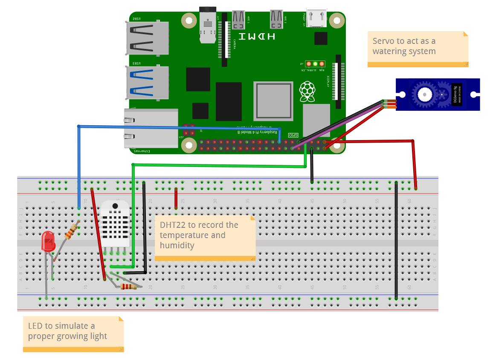
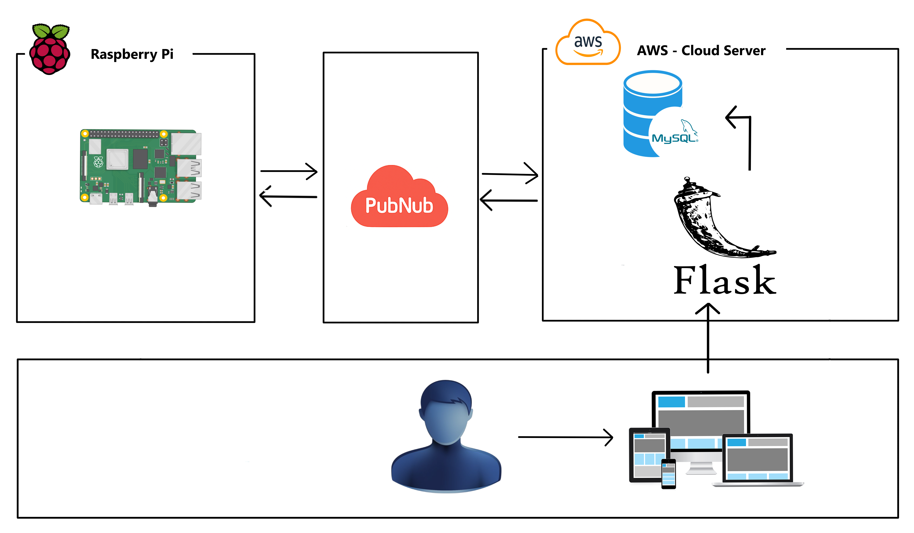

# Greenhouse Monitioring & Control System
<a href="https://www.python.org/"></a>
  <a href="https://www.raspberrypi.com/"></a>

## Overview

This project is a **Raspberry Pi 5 based greenhouse monitoring and control system**. It collects enviromental data using a **DHT22 temprature and humidity sensor** and it allows for remote watering and light control using a Servo Motor and a LED.

The system communicates with a webpage using **PubNub's publish/subscribe model**, allowing for real-time updates and communication between the IoT device and the web server.

## Features
- Temperature & humidity monitoring (DHT22)
- Remote LED control (on/off)
- Remote watering control using a servo
- Manual and scheduled (30-minute) sensor updates
- PubNub-based real-time communication

---

## Hardware Components

- Raspberry Pi 5
- DHT22 Temperature & Humidity Sensor
- LED + 330Ω resistor
- Servo motor (e.g. SG90)
- Breadboard and jumper wires

### Wiring Table

| Component | Component Pin / Wire | Raspberry Pi 5 GPIO |
|---------|----------------------|---------------------|
| DHT22 | Pin 1 (VCC) | 3.3V |
| DHT22 | Pin 2 (DATA) | GPIO 4 |
| DHT22 | Pin 3 | Not connected |
| DHT22 | Pin 4 (GND) | GND |
| LED | Anode (+) via resistor | GPIO 22 |
| LED | Cathode (–) | GND |
| Servo | Signal (Yellow/White) | GPIO 18 |
| Servo | VCC (Red) | External 5V |
| Servo | GND (Brown/Black) | GND (shared with Pi) |

## Hardware Diagram


---

## System Architecture



- The **IoT device (Raspberry Pi)** handles:
  - Sensor readings
  - Actuator control
  - Publishing data
  - Subscribing to commands
- The **Web Application**:
  - Displays sensor data
  - Sends control commands
  - Handles user authentication
- **PubNub** acts as the secure messaging layer between them

---

## Data Flow

1. The Raspberry Pi reads temperature and humidity from the DHT22.
2. Sensor data is published to a PubNub data channel.
3. The web application subscribes to this channel and displays the data.
4. User actions in the web app publish commands (e.g. `led_on`, `water`) to a command channel.
5. The Raspberry Pi subscribes to the command channel and performs the requested action.

## Communication Channels

| Channel Name | Direction | Purpose |
|-------------|----------|---------|
| `greenhouse_data` | Pi → Web | Sensor data publishing |
| `greenhouse_commands` | Web → Pi | Remote control commands 

---

## Data in Transit
- All communication between the IoT device and the web server is handled by **PubNub**.
- PubNub uses **TLS (SSL)** to encrypt data in transit.
- Messages are transmitted over secure HTTPS/WebSocket connections.
- Each message contains only the minimum required data (e.g. sensor values or command actions).

## Data at Rest
#### Raspberry Pi:
- No sensitive data is stored locally on the Raspberry Pi.
- Environment variables are used for:
    - PubNub publish key
    - PubNub subscribe key
    - Device UUID
- Keys are stored in a `.env` file and excluded from version control.

#### Web Server:
- User data is stored in a MySQL database, all passwords are hashed and them stored.
- Keys are stored in a .env file and excluded from version control.

---
## Running

### Create a Virtual enviorment in flask_app & hardware directorys
linux
```
python3 -m venv venv

source venv/bin/activate
```

### Dependancys
#### Flask App:
```
pip install flask flask-sqlalchemy flask-bcrypt mysqlclient pubnub requests python-dotenv
```

#### Raspberry Pi
```
pip install gpiozero pubnub python-dotenv adafruit-circuitpython-dht
```